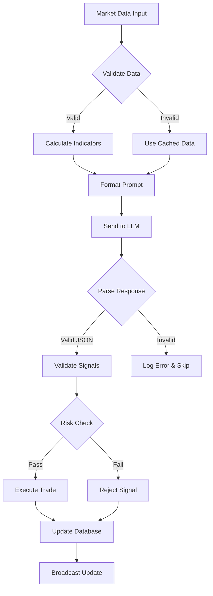

# Planning PRD: LLM-Powered Crypto Trading System MVP

## Purpose
Design and specify an automated cryptocurrency trading system that leverages Large Language Models (LLMs) to make trading decisions based on technical analysis, with 3-minute execution intervals and multi-model support through OpenRouter.

## Initial Concept
Build a Python-based trading system that:
- Invokes LLM agents every 3 minutes with market data
- Supports multiple LLM models through unified API (OpenRouter)
- Executes trades on perpetual futures for 6 cryptocurrencies
- Manages risk through position sizing and stop-loss conditions
- Provides monitoring and performance tracking

---

## Planning Process

### Phase 1: Idea Expansion & Research

#### Context Gathering

```yaml
research_areas:
  market_analysis:
    - competitors: 
      - TradingView automation systems
      - 3Commas AI trading bots
      - Cryptohopper strategy marketplace
      - Pine Script automated strategies
    - user_needs:
      - Consistent strategy execution without emotion
      - 24/7 market monitoring capability
      - Risk management automation
      - Performance tracking and analysis
    - trends:
      - LLM integration in financial analysis
      - Multi-timeframe technical analysis
      - Risk-adjusted position sizing
      - Real-time market data processing
  
  technical_research:
    - existing_solutions:
      - ccxt library for exchange integration
      - pandas/numpy for data processing
      - OpenRouter API for LLM access
      - WebSocket for real-time data
    - libraries:
      - FastAPI for REST endpoints
      - SQLAlchemy for database ORM
      - Redis for caching/queuing
      - Celery for task scheduling
    - patterns:
      - Event-driven architecture
      - Circuit breaker for API failures
      - Strategy pattern for LLM providers
      - Observer pattern for position monitoring
  
  internal_context:
    - current_system:
      - Manual LLM invocation process
      - JSON-based trading signals
      - Position tracking with invalidation conditions
    - constraints:
      - 3-minute decision intervals
      - Must handle 6 concurrent positions
      - LLM token costs consideration
      - Exchange API rate limits
    - integration_points:
      - Exchange APIs (Binance, Bybit, etc.)
      - OpenRouter/LLM provider APIs
      - Market data feeds
      - Monitoring/alerting systems
```

#### Initial Exploration
```
RESEARCH implementation approaches:
  - Event-driven vs. polling architecture
  - Synchronous vs. asynchronous LLM calls
  - Position state management patterns
  - Risk calculation methodologies

ANALYZE technical requirements:
  - Latency requirements (< 1 second for decisions)
  - Data freshness (real-time vs. 3-minute snapshots)
  - Fault tolerance (API failures, network issues)
  - Scalability (multiple trading pairs/strategies)
```

### Phase 2: PRD Structure Generation

#### 1. Executive Summary

```markdown
## Problem Statement
Cryptocurrency traders need a system that can consistently execute technical analysis-based trading strategies 24/7 without emotional bias, while adapting to market conditions using advanced AI reasoning capabilities. Current solutions either lack AI integration or require extensive manual configuration.

## Solution Overview
An automated trading system that leverages Large Language Models to analyze market data every 3 minutes, make informed trading decisions based on technical indicators, and execute trades with proper risk management. The system supports multiple LLM providers through a unified interface and provides comprehensive position tracking and performance analytics.

## Success Metrics
- Decision Latency: < 2 seconds per trading cycle
- System Uptime: > 99.5% availability
- Risk Compliance: 100% adherence to stop-loss rules
- Profitability: Positive Sharpe Ratio > 0.5
- LLM Cost Efficiency: < $100/month for continuous operation
```

#### 2. User Stories & Scenarios

```markdown
## Primary User Flow
```


```markdown
## User Stories

1. **As a trader**, I want the system to analyze markets every 3 minutes so that I can capture short-term opportunities
   - Acceptance Criteria:
     - [ ] System triggers exactly every 3 minutes ±5 seconds
     - [ ] All 6 cryptocurrencies analyzed in parallel
     - [ ] Decisions logged with timestamp and reasoning
   - Edge Cases:
     - Market data feed interruption
     - LLM API timeout/failure
     - Multiple signals for same asset

2. **As a risk manager**, I want automatic position sizing based on confidence levels so that risk is properly controlled
   - Acceptance Criteria:
     - [ ] Position size calculated from risk_usd parameter
     - [ ] Leverage limits enforced (5-40x range)
     - [ ] Stop-loss orders placed immediately
   - Edge Cases:
     - Insufficient margin for position
     - Stop-loss triggered immediately after entry
     - Liquidation price too close to entry

3. **As a system operator**, I want to switch between LLM models without code changes so that I can optimize for cost/performance
   - Acceptance Criteria:
     - [ ] Configuration-based model selection
     - [ ] Seamless failover to backup models
     - [ ] Model performance comparison metrics
   - Edge Cases:
     - Model returns invalid JSON
     - Token limit exceeded
     - Different model response formats
```

#### 3. System Architecture

```markdown
## High-Level Architecture
```


```markdown
## Component Breakdown

**Frontend Components**:
- Dashboard Component: Real-time position monitoring, P&L tracking
- Configuration Panel: LLM model selection, risk parameters
- Performance Analytics: Charts, metrics, trade history
- Alert Manager: Notification settings, error alerts

**Backend Services**:
- Market Data Service: Fetches and processes OHLCV data, calculates indicators
- Decision Service: Prepares prompts, calls LLM, parses responses
- Execution Service: Places orders, manages positions, handles fills
- Monitoring Service: Tracks performance, logs events, alerts on issues

**Data Models**:
- Position: symbol, quantity, entry_price, leverage, stop_loss, take_profit
- MarketData: symbol, timestamp, ohlcv, indicators (EMA, MACD, RSI)
- TradingSignal: symbol, action, confidence, reasoning, risk_parameters
- Performance: timestamp, portfolio_value, positions, sharpe_ratio
```

#### 4. Technical Specifications

```markdown
## API Design
```


```markdown
## Core Endpoints

**POST /api/trading/manual-trigger**
- Request: `{symbols: string[], force: boolean}`
- Response: `{status: string, signals: TradingSignal[], execution: OrderResult[]}`
- Purpose: Manually trigger trading cycle for testing

**GET /api/positions/current**
- Response: `{positions: Position[], total_value: float, available_margin: float}`
- Purpose: Retrieve current portfolio state

**POST /api/config/llm**
- Request: `{provider: string, model: string, api_key: string, temperature: float}`
- Response: `{status: string, model_info: object}`
- Purpose: Configure LLM provider settings

**GET /api/performance/metrics**
- Query: `?timeframe=1h|1d|7d|30d`
- Response: `{sharpe_ratio: float, total_return: float, win_rate: float, trades: int}`
- Purpose: Performance analytics

## Data Flow
```



#### 5. Implementation Strategy

```markdown
## Development Phases
```


```markdown
## Implementation Priority

1. **Foundation (Weeks 1-2)**
   - Set up PostgreSQL database with migrations
   - Create FastAPI application structure
   - Implement exchange API integration (ccxt)
   - Build market data fetching service

2. **Core Trading Logic (Weeks 3-4)**
   - Develop position management system
   - Implement order execution with retry logic
   - Create signal validation and risk checks
   - Build state management for active positions

3. **LLM Integration (Weeks 5-6)**
   - Integrate OpenRouter API
   - Design prompt templates with market data
   - Implement JSON response parsing
   - Add model switching and fallback logic

4. **Risk & Monitoring (Weeks 7-8)**
   - Implement stop-loss and invalidation monitoring
   - Build performance tracking system
   - Create alerting for errors and anomalies
   - Add circuit breakers for system protection

5. **Testing & Deployment (Weeks 9-10)**
   - Comprehensive integration testing
   - Paper trading validation
   - Production environment setup
   - Monitoring and logging configuration
```

### Phase 3: Challenge & Validation

#### Devil's Advocate Analysis

```yaml
challenges:
  technical_risks:
    - risk: "LLM response inconsistency"
      mitigation: "Implement strict JSON schema validation and retry logic"
    
    - risk: "Exchange API rate limits"
      mitigation: "Use WebSocket for data, batch operations, implement backoff"
    
    - risk: "Network latency affecting 3-minute cycles"
      mitigation: "Async processing, parallel API calls, timeout management"
    
    - risk: "Database performance at high frequency"
      mitigation: "Time-series database for market data, indexing strategy"
  
  business_risks:
    - risk: "LLM costs exceeding budget"
      mitigation: "Token usage monitoring, prompt optimization, model selection"
    
    - risk: "Regulatory compliance"
      mitigation: "Audit logging, position limits, user agreements"
    
    - risk: "Capital loss from bad decisions"
      mitigation: "Paper trading mode, position limits, daily loss limits"
  
  edge_cases:
    - scenario: "Market flash crash"
      handling: "Circuit breaker triggers, all positions to safety mode"
    
    - scenario: "LLM returns buy and sell for same asset"
      handling: "Precedence rules, conflict resolution logic"
    
    - scenario: "Exchange maintenance during trading"
      handling: "Fallback to other exchanges, pause trading, alert operator"
    
    - scenario: "Partial order fills"
      handling: "Position reconciliation, adjust or cancel remaining"
```

#### Success Criteria

```markdown
## Definition of Done

- [ ] System executes trading cycles every 3 minutes without manual intervention
- [ ] Supports at least 3 different LLM models through OpenRouter
- [ ] All 6 cryptocurrencies traded simultaneously
- [ ] Stop-loss orders placed and monitored for all positions
- [ ] Real-time dashboard showing positions and performance
- [ ] Test coverage > 80% for critical paths
- [ ] Paper trading for 7 days with positive Sharpe ratio
- [ ] API response time < 500ms for all endpoints
- [ ] System recovers from failures within 1 cycle (3 minutes)
- [ ] Complete API documentation and deployment guide

## Measurable Outcomes

- Cycle Execution Rate: > 99% (failures < 1%)
- Decision Latency: < 2 seconds average
- Position Accuracy: 100% (no position mismatches)
- Risk Compliance: Zero violations of stop-loss rules
- System Uptime: > 99.5% availability
- Cost Efficiency: < $100/month for LLM usage
- Performance: Sharpe Ratio > 0.5 after 30 days
```

### Phase 4: Validation & Output

#### Pre-Implementation Checklist

```
VALIDATE assumptions:
  ✓ OpenRouter API supports required throughput
  ✓ Exchange APIs provide necessary data granularity
  ✓ PostgreSQL can handle transaction volume
  ✓ Python async performance meets latency requirements

REVIEW with stakeholders:
  ✓ Risk parameters acceptable
  ✓ LLM cost budget approved
  ✓ Regulatory requirements understood
  ✓ Backup and recovery plan approved

CONFIRM dependencies:
  ✓ Exchange API keys available
  ✓ OpenRouter account set up
  ✓ Infrastructure provisioned
  ✓ Monitoring tools configured
```

## Technical Stack Recommendation

```yaml
backend:
  language: Python 3.11+
  framework: FastAPI
  task_queue: Celery with Redis
  database: PostgreSQL + TimescaleDB
  cache: Redis
  
market_data:
  library: ccxt
  processing: pandas, numpy
  indicators: ta-lib
  
llm_integration:
  primary: OpenRouter API
  fallback: Direct OpenAI/Anthropic APIs
  prompt_management: Jinja2 templates
  
frontend:
  framework: React with TypeScript
  state: Redux Toolkit
  charts: TradingView Lightweight Charts
  websocket: socket.io-client
  
infrastructure:
  container: Docker
  orchestration: Docker Compose (MVP)
  monitoring: Prometheus + Grafana
  logging: ELK stack (optional)
  
testing:
  unit: pytest
  integration: pytest + testcontainers
  load: locust
  coverage: pytest-cov
```

## MVP Deliverables

1. **Core Trading System**
   - Automated 3-minute trading cycles
   - LLM integration with OpenRouter
   - Position management with stop-losses
   - Basic error recovery

2. **Monitoring Dashboard**
   - Real-time position display
   - P&L tracking
   - Performance metrics
   - System health indicators

3. **Configuration Management**
   - LLM model selection
   - Risk parameters
   - Trading pair enable/disable
   - API key management

4. **Documentation**
   - API documentation (OpenAPI)
   - Deployment guide
   - Configuration guide
   - Troubleshooting guide

## Next Steps

1. **Immediate Actions**
   - Set up development environment
   - Create project repository structure
   - Initialize database schemas
   - Implement basic FastAPI skeleton

2. **Week 1 Goals**
   - Complete market data fetcher
   - Establish exchange connectivity
   - Create position tracking models
   - Set up automated testing

3. **Critical Path Items**
   - LLM prompt optimization
   - Order execution reliability
   - Stop-loss monitoring system
   - Performance tracking accuracy

## Anti-Patterns to Avoid

- ❌ Synchronous API calls blocking the event loop
- ❌ Storing sensitive API keys in code or configs
- ❌ Direct database writes from multiple services
- ❌ Tight coupling between LLM provider and business logic
- ❌ Missing circuit breakers for external services
- ❌ Hardcoded trading parameters
- ❌ No position reconciliation mechanism
- ❌ Missing audit trail for decisions

## Success Indicators

- ✅ System can run unattended for 24+ hours
- ✅ All trading decisions are logged and traceable
- ✅ Graceful degradation when services fail
- ✅ Clear separation of concerns in architecture
- ✅ New LLM models can be added without code changes
- ✅ Performance metrics match backtesting results
- ✅ System alerts before critical failures
- ✅ Recovery from crashes without position loss

## Appendix A: Sample LLM Prompt Structure

```python
prompt_template = """
You are an automated cryptocurrency trading agent managing a perpetual futures portfolio. 
Your role is to analyze market data and make trading decisions every 3 minutes.

CURRENT MARKET STATE FOR ALL COINS
Trading session active for {minutes_elapsed} minutes. Current time: {timestamp}.

{for coin in coins}
{coin} DATA:
- Current: price={price}, ema20={ema}, macd={macd}, rsi7={rsi}
- Open Interest: {oi_latest} (avg: {oi_avg})
- Funding Rate: {funding_rate}
- Price series: {prices}
- Indicators: {indicators}
{/for}

ACCOUNT STATUS:
- Total Return: {return_pct}%
- Account Value: ${account_value}
- Available Cash: ${cash}

CURRENT POSITIONS:
{positions}

DECISION FRAMEWORK:
For each coin, choose ONE action: buy_to_enter, sell_to_enter, hold, or close_position

OUTPUT FORMAT:
Return ONLY a JSON object with trading signals. NO NARRATION.
{example_json}
"""
```

## Appendix B: Database Schema Overview

```sql
-- Core tables for MVP
CREATE TABLE positions (
    id SERIAL PRIMARY KEY,
    symbol VARCHAR(10) NOT NULL,
    quantity DECIMAL(20, 8) NOT NULL,
    entry_price DECIMAL(20, 8) NOT NULL,
    leverage INTEGER NOT NULL,
    stop_loss DECIMAL(20, 8),
    take_profit DECIMAL(20, 8),
    status VARCHAR(20) NOT NULL,
    created_at TIMESTAMP NOT NULL,
    updated_at TIMESTAMP NOT NULL
);

CREATE TABLE trading_signals (
    id SERIAL PRIMARY KEY,
    symbol VARCHAR(10) NOT NULL,
    signal_type VARCHAR(20) NOT NULL,
    confidence DECIMAL(3, 2) NOT NULL,
    risk_usd DECIMAL(20, 2) NOT NULL,
    reasoning TEXT,
    llm_model VARCHAR(100),
    executed BOOLEAN DEFAULT FALSE,
    created_at TIMESTAMP NOT NULL
);

CREATE TABLE market_data (
    symbol VARCHAR(10) NOT NULL,
    timestamp TIMESTAMP NOT NULL,
    open DECIMAL(20, 8) NOT NULL,
    high DECIMAL(20, 8) NOT NULL,
    low DECIMAL(20, 8) NOT NULL,
    close DECIMAL(20, 8) NOT NULL,
    volume DECIMAL(20, 8) NOT NULL,
    indicators JSONB,
    PRIMARY KEY (symbol, timestamp)
);

CREATE TABLE performance_metrics (
    id SERIAL PRIMARY KEY,
    timestamp TIMESTAMP NOT NULL,
    portfolio_value DECIMAL(20, 2) NOT NULL,
    total_return DECIMAL(10, 4) NOT NULL,
    sharpe_ratio DECIMAL(10, 4),
    positions_snapshot JSONB,
    created_at TIMESTAMP NOT NULL
);
```

---

This PRD provides a comprehensive blueprint for building the LLM-powered crypto trading system MVP. The modular architecture allows for incremental development while maintaining system integrity, and the risk management focus ensures safe operation even during the development phase.
