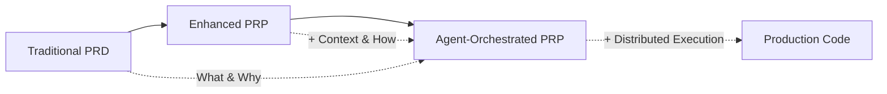

# Product Requirement Prompt (PRP) with Agent Orchestration

"Over-specifying what to build while under-specifying the context, and how to build it, is why so many AI-driven coding attempts stall at 80%. A Product Requirement Prompt (PRP) fixes that by fusing the disciplined scope of a classic Product Requirements Document (PRD) with the "context-is-king" mindset of modern prompt engineering—now enhanced with distributed agent orchestration."

## 🚀 What's New: Agent-Orchestrated PRPs

PRPs now work seamlessly with our **10 specialized AI agents**, each focusing on their domain expertise while coordinating through a lightweight task registry. This enables:

- **Parallel execution** of PRP sections by different agents
- **Minimal context loading** (2-5KB per agent vs 50KB+ traditional)
- **Phase-based validation** with specialized agents
- **Automatic handoffs** between implementation and testing

## What is a PRP?

A PRP (Product Requirement Prompt) is a structured prompt that supplies AI coding agents with everything needed to deliver production-ready software—no more, no less.

### Evolution: PRD → PRP → Agent-Orchestrated PRP



## The Three Pillars of Modern PRPs

### 1. Context (Now Agent-Optimized)

Instead of loading everything for every agent:
```yaml
traditional:
  all_agents_load: "50KB full PRP"

optimized:
  business_analyst: "2KB requirements section"
  implementation: "3KB technical context"
  validation: "2KB test requirements"
```

**Agent-specific context includes:**
- Precise file paths relevant to their role
- Library versions they need to know
- Code snippets for their tasks
- Documentation from `ai_docs/` filtered by relevance

### 2. Implementation Strategy (Now Distributed)

Different agents handle different aspects:

| Agent | PRP Section | Responsibility |
|-------|-------------|----------------|
| **Business Analyst** | Goal, Why, Success Criteria | Requirements clarity |
| **Integration Architect** | API Design, System Architecture | Technical design |
| **Implementation Specialist** | Implementation Blueprint | Code execution |
| **Validation Engineer** | Validation Gates | Testing & QA |
| **Security Auditor** | Security Requirements | Compliance checks |
| **DevOps Engineer** | Deployment Strategy | Infrastructure |

### 3. Validation Gates (Now Phase-Based)

Each phase has specialized validation by the appropriate agent:

```bash
# Phase 1: Requirements (Business Analyst)
✓ User stories complete
✓ Success metrics defined
✓ Stakeholder approval

# Phase 2: Architecture (Integration Architect)
✓ API contracts defined
✓ Security requirements integrated
✓ Performance targets set

# Phase 4: Implementation (Validation Engineer)
✓ pytest tests/  # Unit tests
✓ ruff check    # Code quality
✓ mypy .        # Type checking
✓ coverage >80% # Test coverage

# Phase 6: Deployment (DevOps Engineer)
✓ Infrastructure configured
✓ Monitoring active
✓ Rollback tested
```

## PRP Structure with Agent Assignments

```markdown
# PRP: [Feature Name]

## 📋 Goal
*Agent: Business Analyst*
[Clear end state and user value]

## 💡 Why
*Agent: Business Analyst*
[Business value and impact]

## ✅ What (Success Criteria)
*Agent: Business Analyst + Validation Engineer*
- [ ] User-visible behavior
- [ ] Technical requirements
- [ ] Performance targets

## 📚 All Needed Context
*Agent: Context Researcher*
### Documentation & References
- url: [relevant docs]
- file: [codebase examples]
- gotchas: [known issues]

## 🏗️ Architecture
*Agent: Integration Architect*
### System Design
[Architecture decisions]
### API Contracts
[Endpoint specifications]

## 💻 Implementation Blueprint
*Agent: Implementation Specialist*
### Tasks
1. [Concrete implementation steps]
2. [Pseudocode with critical details]

## 🔒 Security Requirements
*Agent: Security Auditor*
[Security checks and compliance]

## 🧪 Validation Loop
*Agent: Validation Engineer*
### Level 1: Syntax
```bash
ruff check --fix
mypy .
```

### Level 2: Unit Tests
```bash
pytest tests/ -v
```

### Level 3: Integration
```bash
curl -X POST http://localhost:8000/endpoint
```

## 🚀 Deployment
*Agent: DevOps Engineer*
[Deployment strategy and monitoring]
```

## Using PRPs with Agent Orchestration

### Step 1: Create PRP with Orchestrator

```bash
# Orchestrator coordinates PRP creation
"PRP Orchestrator, create comprehensive PRP for: payment processing with Stripe"

# Or use command
/prp-planning-create payment processing feature
```

### Step 2: Automatic Task Distribution

The orchestrator automatically:
1. Parses PRP sections
2. Creates tasks in registry
3. Assigns to appropriate agents
4. Sets up dependencies

```json
{
  "TASK-001": {
    "title": "Define payment requirements",
    "agent": "business-analyst",
    "prp_section": "Goal, Why, Success Criteria"
  },
  "TASK-002": {
    "title": "Design payment API",
    "agent": "integration-architect",
    "prp_section": "Architecture, API Contracts",
    "depends_on": ["TASK-001"]
  }
}
```

### Step 3: Parallel Execution

Multiple agents work simultaneously:
```
Business Analyst → Requirements
                 ↘
                   Integration Architect → API Design
                 ↗                       ↘
Context Researcher → Documentation        Implementation → Code
                                        ↗
                   Security Auditor → Compliance Check
```

### Step 4: Progressive Validation

Each phase validated before proceeding:
```python
def validate_phase(phase_num):
    gates = load_validation_gates(phase_num)
    for gate in gates:
        if not gate.check():
            return False, gate.error
    return True, "Phase complete"
```

## PRP Templates with Agent Support

### Available Templates

1. **`prp_base.md`** - Standard PRP with agent sections
2. **`prp_planning.md`** - Planning-focused with business analyst emphasis
3. **`prp_spec.md`** - Technical specification for architects
4. **`prp_task.md`** - Single task for implementation specialist

### Using Templates

```bash
# Copy and customize
cp PRPs/templates/prp_base.md PRPs/features/my-feature.md

# Edit with agent assignments
vim PRPs/features/my-feature.md

# Generate agent views (2-5KB each instead of 50KB)
python scripts/generate-agent-views.py --all

# Execute with orchestrator
/prp-base-execute PRPs/features/my-feature.md
```

## Best Practices for Agent-Orchestrated PRPs

### 1. Context Optimization

❌ **Don't:** Include everything for everyone
```markdown
## Context
[50KB of documentation that most agents don't need]
```

✅ **Do:** Tag sections for specific agents
```markdown
## Context
### For Implementation (*Agent: Implementation Specialist*)
[3KB of relevant code examples]

### For Testing (*Agent: Validation Engineer*)
[2KB of test requirements]
```

### 2. Clear Dependencies

❌ **Don't:** Ambiguous task ordering
```markdown
- Build API
- Write tests
- Design system
```

✅ **Do:** Explicit dependency chain
```markdown
1. Design system architecture →
2. Define API contracts →
3. Implement API →
4. Write tests →
5. Deploy
```

### 3. Measurable Gates

❌ **Don't:** Vague validation
```markdown
- Code should work
- Tests should pass
```

✅ **Do:** Specific, executable gates
```markdown
✓ pytest tests/ --cov=src --cov-report=term-missing
✓ Coverage >= 80%
✓ ruff check src/ --exit-non-zero-on-fix
✓ mypy src/ --strict
```

## Advanced PRP Patterns

### Pattern 1: Multi-Agent Research PRP

```markdown
## Research Task: Evaluate Database Options

### Phase 1: Context Research
*Agent: Context Researcher*
- Investigate current database usage
- Document pain points

### Phase 2: Architecture Analysis
*Agent: Integration Architect*
- Evaluate options (PostgreSQL, MongoDB, DynamoDB)
- Create comparison matrix

### Phase 3: Performance Testing
*Agent: Performance Optimizer*
- Benchmark each option
- Analyze results

### Phase 4: Recommendation
*Agent: PRP Orchestrator*
- Synthesize findings
- Present recommendation
```

### Pattern 2: Hotfix PRP (2-4 hours)

```markdown
## HOTFIX: Payment Gateway Timeout

### Immediate Action
*Agents: Context Researcher + Implementation Specialist*
- Identify root cause (parallel investigation)
- Implement fix

### Validation
*Agent: Validation Engineer*
- Emergency test suite
- Production smoke test

### Deployment
*Agent: DevOps Engineer*
- Express deployment
- Monitor metrics
```

### Pattern 3: Feature Flag PRP

```markdown
## Feature: Dark Mode Toggle

### Parallel Tracks:
Track 1 (Backend):
- *Agent: Implementation Specialist*
- Add feature flag service

Track 2 (Frontend):
- *Agent: Implementation Specialist*
- Implement UI toggle

Track 3 (Testing):
- *Agent: Validation Engineer*
- E2E tests for both states

### Convergence:
- *Agent: Integration Architect*
- Integrate all components
```

## Measuring PRP Success

### Metrics Tracked Automatically

| Metric | Target | Measured By |
|--------|--------|-------------|
| First-pass success | >80% | Validation gates |
| Context per agent | <5KB | View generator |
| Time to production | <2 weeks | Phase tracking |
| Test coverage | >80% | Coverage tools |
| Security compliance | 100% | Security auditor |

### PRP Quality Score

```python
def calculate_prp_score(prp):
    score = 0
    score += 20 if prp.has_clear_goal else 0
    score += 20 if prp.has_success_criteria else 0
    score += 20 if prp.has_context_docs else 0
    score += 20 if prp.has_validation_gates else 0
    score += 20 if prp.has_agent_assignments else 0
    return score  # 100 = perfect PRP
```

## Quick Reference

### Create PRP
```bash
/prp-planning-create [feature description]
# or
cp PRPs/templates/prp_base.md PRPs/my-feature.md
```

### Distribute to Agents
```bash
python scripts/generate-agent-views.py --all
```

### Execute PRP
```bash
/prp-base-execute PRPs/my-feature.md
# or
python PRPs/scripts/prp_runner.py --prp my-feature --interactive
```

### Monitor Progress
```bash
python scripts/agent-task-manager.py status
cat .agent-system/registry/milestones.md
```

## Summary

The evolution from PRD → PRP → Agent-Orchestrated PRP represents a paradigm shift in AI-assisted development:

- **PRD:** What to build (product focus)
- **PRP:** What + How + Context (AI-ready)
- **Agent-Orchestrated PRP:** Distributed, parallel, minimal context (production-ready)

By combining comprehensive context with intelligent agent orchestration, we achieve:
- ✅ One-pass implementation success
- ✅ 90-95% context reduction per agent
- ✅ Parallel execution by specialists
- ✅ Phase-based validation gates
- ✅ Production-ready code faster

---

**Remember:** A great PRP provides each agent with exactly what they need—no more, no less. Context is king, but targeted context is emperor.
