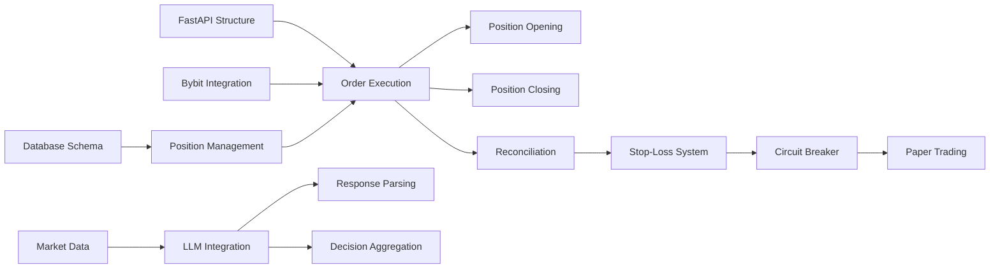

# Implementation Plan - LLM Crypto Trading System

## Executive Summary

This document outlines the complete implementation plan for the LLM-Powered Cryptocurrency Trading System. The implementation follows a 10-week timeline with 40 distinct tasks organized across 5 development phases.

**Total Estimated Effort**: 380 story points (~760 development hours)
**Timeline**: 10 weeks (2.5 months)
**Team Size**: 1-2 developers with specialized agent support

## Implementation Phases

### Week 1-2: Foundation Layer (80 story points)
**Objective**: Establish core infrastructure and database foundation

**Tasks**:
1. TASK-001: Database Schema Setup (13 points)
   - PostgreSQL + TimescaleDB installation
   - Schema migrations
   - Connection pooling configuration

2. TASK-002: FastAPI Application Structure (8 points)
   - Project structure setup
   - Configuration management
   - Base API endpoints

3. TASK-003: Bybit Integration Foundation (13 points)
   - ccxt library integration
   - Authentication setup
   - Basic API client wrapper

4. TASK-004: Redis Cache Setup (5 points)
   - Redis installation
   - Connection configuration
   - Caching layer abstraction

5. TASK-005: Position Management System (21 points)
   - Position tracking tables
   - State management logic
   - Position reconciliation framework

6. TASK-006: Configuration Management (8 points)
   - Environment variables
   - YAML configuration files
   - Secret management

7. TASK-007: Logging Infrastructure (5 points)
   - Structured logging setup
   - Log rotation
   - Log aggregation

8. TASK-008: Development Environment (8 points)
   - Docker containers
   - Development database
   - Test fixtures

**Deliverables**:
- Working database with schema
- Basic FastAPI application
- Bybit connectivity established
- Position tracking operational

**Validation Gates**:
- [ ] Database migrations run successfully
- [ ] FastAPI endpoints respond
- [ ] Bybit testnet connection verified
- [ ] Position CRUD operations working

### Week 3-4: Core Trading Logic (85 story points)
**Objective**: Implement core trading mechanics and order management

**Tasks**:
9. TASK-009: Order Execution System (21 points)
   - Order placement logic
   - Order status tracking
   - Retry mechanisms

10. TASK-010: Position Opening Logic (13 points)
    - Position sizing calculation
    - Margin requirements
    - Entry price tracking

11. TASK-011: Position Closing Logic (13 points)
    - Close position flows
    - Partial close handling
    - P&L calculation

12. TASK-012: Order Validation (8 points)
    - Pre-trade checks
    - Balance verification
    - Limit validation

13. TASK-013: Position Reconciliation (21 points)
    - Exchange position sync
    - Database state sync
    - Discrepancy resolution

14. TASK-014: Trade History Tracking (5 points)
    - Trade logging
    - History storage
    - Audit trail

15. TASK-015: Error Recovery System (8 points)
    - Error handling
    - Recovery procedures
    - State restoration

16. TASK-016: Trading State Machine (13 points)
    - State transitions
    - State persistence
    - State validation

17. TASK-017: Market Data Collection (13 points)
    - OHLCV data fetching
    - WebSocket integration
    - Data normalization

18. TASK-018: Technical Indicators (8 points)
    - pandas-ta integration
    - Indicator calculation
    - Caching strategy

**Deliverables**:
- Complete order management system
- Position lifecycle management
- Market data pipeline
- Technical indicators

**Validation Gates**:
- [ ] Orders execute on testnet
- [ ] Positions open/close correctly
- [ ] Reconciliation identifies discrepancies
- [ ] Market data flows consistently

### Week 5-6: LLM Integration (75 story points)
**Objective**: Integrate LLM decision-making capabilities

**Tasks**:
19. TASK-019: DeepSeek API Integration (13 points)
    - API client implementation
    - Authentication
    - Rate limiting

20. TASK-020: Qwen3 Max Backup Integration (8 points)
    - Secondary API client
    - Failover logic
    - Model switching

21. TASK-021: Prompt Template System (21 points)
    - Template management
    - Variable injection
    - Context building

22. TASK-022: Market Analysis Prompts (13 points)
    - Technical analysis prompts
    - Sentiment analysis prompts
    - Pattern recognition prompts

23. TASK-023: JSON Response Parsing (8 points)
    - Response validation
    - Schema enforcement
    - Error handling

24. TASK-024: Token Usage Tracking (5 points)
    - Usage monitoring
    - Cost calculation
    - Budget alerts

25. TASK-025: Model Performance Tracking (5 points)
    - Response time monitoring
    - Success rate tracking
    - Quality metrics

26. TASK-026: Decision Aggregation (13 points)
    - Multi-signal combination
    - Confidence scoring
    - Signal validation

**Deliverables**:
- Working LLM integration
- Prompt template library
- Response parsing system
- Token tracking

**Validation Gates**:
- [ ] LLM responds to market queries
- [ ] JSON parsing handles edge cases
- [ ] Token costs tracked accurately
- [ ] Failover works seamlessly

### Week 7-8: Risk Management & Monitoring (80 story points)
**Objective**: Implement comprehensive risk controls and monitoring

**Tasks**:
27. TASK-027: Stop-Loss System (21 points)
    - Multi-layer stop-loss
    - Dynamic adjustment
    - Emergency close logic

28. TASK-028: Circuit Breaker Implementation (13 points)
    - Daily loss limit (-CHF 183.89)
    - Position close triggers
    - System shutdown logic

29. TASK-029: Position Sizing Calculator (8 points)
    - Kelly criterion implementation
    - Risk-based sizing
    - Leverage calculation

30. TASK-030: Risk Metrics Calculation (8 points)
    - Sharpe ratio
    - Maximum drawdown
    - Win/loss ratios

31. TASK-031: Performance Dashboard (13 points)
    - Real-time P&L
    - Position overview
    - Risk metrics display

32. TASK-032: Alert System (8 points)
    - Email notifications
    - Critical alerts
    - Performance reports

33. TASK-033: Prometheus Metrics (5 points)
    - Metric exporters
    - Custom metrics
    - Grafana dashboards

34. TASK-034: Health Monitoring (8 points)
    - System health checks
    - Dependency monitoring
    - Auto-recovery triggers

**Deliverables**:
- Complete risk management system
- Monitoring dashboards
- Alert system
- Performance tracking

**Validation Gates**:
- [ ] Stop-losses trigger correctly
- [ ] Circuit breaker activates at -7%
- [ ] Alerts fire on critical events
- [ ] Dashboards display real-time data

### Week 9-10: Testing & Deployment (60 story points)
**Objective**: Comprehensive testing and production deployment

**Tasks**:
35. TASK-035: Unit Test Suite (13 points)
    - Component tests
    - Mock integrations
    - Coverage targets (>80%)

36. TASK-036: Integration Testing (13 points)
    - End-to-end flows
    - External service tests
    - Error scenarios

37. TASK-037: Paper Trading Setup (21 points)
    - Testnet configuration
    - 7-day continuous run
    - Performance validation

38. TASK-038: Production Deployment (8 points)
    - Server setup
    - Environment configuration
    - SSL/security setup

39. TASK-039: Monitoring Configuration (5 points)
    - Production alerts
    - Log aggregation
    - Performance monitoring

40. TASK-040: Documentation & Handover (8 points)
    - User documentation
    - Operational runbooks
    - Maintenance guides

**Deliverables**:
- Complete test suite
- Paper trading results
- Production deployment
- Documentation package

**Validation Gates**:
- [ ] Test coverage >80%
- [ ] 7 days paper trading profitable
- [ ] Production health checks pass
- [ ] Documentation complete

## Critical Path Analysis

The critical path flows through:
1. Database Schema (TASK-001) →
2. Position Management (TASK-005) →
3. Order Execution (TASK-009) →
4. Position Reconciliation (TASK-013) →
5. DeepSeek Integration (TASK-019) →
6. Stop-Loss System (TASK-027) →
7. Paper Trading (TASK-037)

**Critical Path Duration**: 8.5 weeks
**Total Float**: 1.5 weeks

## Parallel Work Opportunities

### Can Execute in Parallel:
- Market data pipeline (TASK-017) || LLM integration (TASK-019-026)
- Logging (TASK-007) || Monitoring (TASK-033-034)
- Unit tests (TASK-035) || Documentation (TASK-040)
- Technical indicators (TASK-018) || Prompt templates (TASK-021)

### Must Execute Sequentially:
1. Database → Position Management → Order System
2. Order System → Risk Management
3. All components → Integration Testing → Paper Trading

## Resource Allocation

### Developer 1 (Core Systems):
- Weeks 1-2: Database, Position Management
- Weeks 3-4: Order Execution, Reconciliation
- Weeks 5-6: Core LLM Integration
- Weeks 7-8: Risk Management
- Weeks 9-10: Testing & Deployment

### Developer 2 or Agent Support:
- Weeks 1-2: FastAPI, Configuration
- Weeks 3-4: Market Data, Indicators
- Weeks 5-6: Prompt Engineering
- Weeks 7-8: Monitoring, Dashboards
- Weeks 9-10: Documentation, Testing

## Risk Mitigation Strategies

### Technical Risks:
1. **WebSocket Disconnections**
   - Mitigation: Auto-reconnect with exponential backoff
   - Implementation: Week 3

2. **LLM Response Failures**
   - Mitigation: Fallback to Qwen3, safe defaults
   - Implementation: Week 5

3. **Position Discrepancies**
   - Mitigation: 5-minute reconciliation, alerts
   - Implementation: Week 4

4. **Circuit Breaker Bugs**
   - Mitigation: Extensive testing, fail-safe close-all
   - Implementation: Week 7

### Schedule Risks:
1. **LLM Integration Delays**
   - Buffer: 1 week float available
   - Mitigation: Start prompt engineering early

2. **Paper Trading Issues**
   - Buffer: Can extend into week 11
   - Mitigation: Start on testnet early

## Milestones & Validation Gates

### Milestone 1: Foundation Complete (End of Week 2)
- Database operational
- Basic API structure
- Exchange connectivity
- Position tracking working

### Milestone 2: Trading Core Complete (End of Week 4)
- Orders execute successfully
- Positions managed properly
- Market data flowing
- Reconciliation operational

### Milestone 3: Intelligence Layer Complete (End of Week 6)
- LLM making decisions
- Prompts optimized
- Token costs tracked
- Failover tested

### Milestone 4: Risk Controls Active (End of Week 8)
- Stop-losses working
- Circuit breakers tested
- Monitoring active
- Alerts configured

### Milestone 5: Production Ready (End of Week 10)
- All tests passing
- Paper trading profitable
- Documentation complete
- Deployed to production

## Success Metrics

### Phase 4 Completion Criteria:
- [ ] 40/40 tasks completed
- [ ] Test coverage >80%
- [ ] Paper trading Sharpe >0.5
- [ ] Decision latency <2 seconds
- [ ] Stop-loss adherence 100%
- [ ] LLM costs <$100/month projected
- [ ] 7 days continuous operation
- [ ] Zero critical bugs in production

## Recommendations for Implementation Start

### Week 1 Kickoff Actions:
1. **Monday**: Set up development environment, install PostgreSQL/TimescaleDB
2. **Tuesday**: Create database schema, run migrations
3. **Wednesday**: Initialize FastAPI project, basic structure
4. **Thursday**: Integrate ccxt, test Bybit connectivity
5. **Friday**: Implement position tracking tables

### First Agent Assignment:
**Implementation Specialist** should start with TASK-001 (Database Schema Setup)
- Load context: database-schema.md, technical-gotchas.md
- Deliverable: Working schema with migrations
- Handoff to: TASK-005 (Position Management)

### Daily Standup Focus:
- Morning: Review previous day's progress
- Plan: Identify day's tasks
- Blockers: Address immediately
- Testing: Run validation suite
- Document: Update changelogs

## Appendix: Task Dependencies

## Next Steps

1. Create individual implementation PRPs (8 documents)
2. Register all 40 tasks in agent-task-manager
3. Assign first tasks to Implementation Specialist
4. Set up daily progress tracking
5. Initialize monitoring dashboards

---

**Document Status**: Complete
**Phase**: 3 - Implementation Planning
**Last Updated**: 2024-10-27
**Next Review**: Start of Week 1 Implementation