# Agent Workspace Setup Summary - v2.0

## 🎯 Distributed Agent Coordination System Initialized

Your PRPs-agentic-eng project is now configured with a state-of-the-art distributed agent coordination framework, enabling 10 specialized AI agents to work in parallel with minimal context loading (2-5KB per agent vs traditional 50KB+).

## 🚀 What's Been Set Up

### 1. Agent Coordination Layer (`.agent-system/`)

```
.agent-system/
├── registry/              # Lightweight JSON-based tracking
│   ├── tasks.json        # Central task registry
│   ├── dependencies.json # Task dependency graph
│   └── milestones.md     # Human-readable progress
├── sessions/             # Multi-session coordination
│   ├── active/           # Current session locks
│   └── history/          # Completed sessions
├── agents/               # 10 specialized agent workspaces
│   └── {agent-name}/
│       ├── context.json  # Agent configuration
│       ├── tasks.json    # Assigned tasks
│       └── changelog.md  # Change history
└── sync/                 # Cross-agent communication
    ├── broadcasts.json   # System-wide updates
    ├── handoffs.json     # Task transitions
    └── conflicts.json    # Conflict resolution
```

### 2. The 10 Specialized Agents

| Agent | Role | Primary Phase | Max Context |
|-------|------|---------------|-------------|
| **PRP Orchestrator** | Workflow coordination | All phases | 12,000 tokens |
| **Business Analyst** | Requirements & metrics | Phase 1 | 8,000 tokens |
| **Context Researcher** | Codebase investigation | Phase 0-1 | 10,000 tokens |
| **Implementation Specialist** | Core development | Phase 4 | 8,000 tokens |
| **Validation Engineer** | Testing & QA | Phase 4-5 | 8,000 tokens |
| **Integration Architect** | System design | Phase 2 | 10,000 tokens |
| **Documentation Curator** | Documentation | Phase 5 | 6,000 tokens |
| **Security Auditor** | Security & compliance | Phase 2,4 | 8,000 tokens |
| **Performance Optimizer** | Performance tuning | Phase 7 | 8,000 tokens |
| **DevOps Engineer** | Deployment & infra | Phase 5-6 | 8,000 tokens |

### 3. Optimized Workspace Structure

```
workspace/
├── features/             # Feature-based development
│   └── {feature-name}/
│       ├── .meta/       # Feature metadata
│       │   ├── owner.json      # Agent ownership
│       │   ├── status.json     # Current status
│       │   └── deps.json       # Dependencies
│       ├── src/         # Source code (any language)
│       ├── tests/       # Feature tests
│       ├── docs/        # Documentation
│       └── contracts/   # API contracts
├── fixes/               # Hotfixes (2-4 hour workflow)
└── shared/              # Reusable components
```

### 4. Context Minimization System

**Traditional Approach:** Load entire PRPs (50KB+)
**New Approach:** Agent-specific views (2-5KB)
**Result:** 90-95% context reduction

```yaml
# Example from .claude/context-loader.yaml
agents:
  implementation-specialist:
    always_load: [2KB]     # Essential context only
    conditional_load: [3KB] # Task-specific content
    never_load: [45KB]     # Excluded unnecessary files
    total_typical: 5KB     # vs 50KB traditional
```

### 5. Multi-Technology Support

```yaml
# stacks/.stack-detection.yaml
Supported stacks:
  - Python (3.11) - pytest, black, mypy, ruff
  - Java (17) - junit5, maven, gradle
  - JavaScript (Node 20) - jest, eslint, webpack
  - TypeScript - tsc, strict mode
  - Go (1.21) - go test, golangci-lint
  - Rust - cargo test, clippy
  - C# (.NET 8) - xunit, dotnet format
```

## 🛠️ Power Tools Created

### 1. Agent Task Manager (`scripts/agent-task-manager.py`)

```bash
# Create tasks
python scripts/agent-task-manager.py create \
  --title "Implement OAuth2 authentication" \
  --priority critical \
  --hours 16

# Claim for agent
python scripts/agent-task-manager.py claim \
  --agent implementation-specialist \
  --task TASK-001

# Complete with notes
python scripts/agent-task-manager.py complete \
  --task TASK-001 \
  --notes "OAuth2 implemented with refresh tokens"

# Handoff between agents
python scripts/agent-task-manager.py handoff \
  --task TASK-001 \
  --to-agent validation-engineer \
  --notes "Ready for security testing"

# Monitor status
python scripts/agent-task-manager.py status
```

### 2. Agent View Generator (`scripts/generate-agent-views.py`)

```bash
# Generate all agent views (reduces 50KB to 2-5KB each)
python scripts/generate-agent-views.py --all

# Generate specific agent view
python scripts/generate-agent-views.py --agent implementation-specialist

# Generate task brief
python scripts/generate-agent-views.py --task TASK-001

# Clean and regenerate
python scripts/generate-agent-views.py --clean --all
```

### 3. Complete Setup Script (`scripts/complete-setup.py`)

Initializes entire workspace with all directories, configurations, and example data.

## 📊 Workflow Orchestration

### 7-Phase Standard Workflow

```mermaid
graph LR
    P0[🚀 Init] --> P1[📋 Discovery]
    P1 --> P2[🏗️ Architecture]
    P2 --> P3[📝 Planning]
    P3 --> P4[💻 Implementation]
    P4 --> P5[📦 Deploy Prep]
    P5 --> P6[🚢 Go-Live]
    P6 --> P7[⚡ Optimization]
```



### Workflow Types & Durations

| Workflow | Duration | Agents | Use Case |
|----------|----------|--------|----------|
| **Standard** | 1-2 weeks | All 10 | Complex features |
| **Hotfix** | 2-4 hours | 3-4 | Emergency fixes |
| **Small Feature** | <1 day | 4-5 | Simple additions |
| **Research** | Variable | 2-3 | Technical investigation |

## 🔑 Key Innovations

### 1. Lock-Free Task Coordination
- No blocking operations
- Session-based claiming
- Automatic conflict resolution

### 2. Progressive Context Loading
```python
# Agent loads only what's needed
if task.phase == "implementation":
    load("task-brief.md")      # 1KB
    load("api-contract.md")     # 2KB
    # Skip: full-prd.md (20KB), other-agent-logs.md (15KB)
```

### 3. Structured Handoffs
```json
{
  "handoff_id": "HO-001",
  "from_agent": "implementation-specialist",
  "to_agent": "validation-engineer",
  "task": "TASK-001",
  "status": "ready-for-testing",
  "files_modified": ["auth.py", "test_auth.py"],
  "next_actions": ["Run security scan", "Load test endpoints"]
}
```

### 4. Automatic Impact Analysis
Changes to files trigger notifications to relevant agents based on dependency graph.

## 🚦 Quick Start Commands

### Initialize Project
```bash
# In Claude Code
/prime-core
"Load AGENT-ORCHESTRATION.md and initialize all agents for project: [name]"
```

### Create & Assign Tasks
```bash
# Create task
python scripts/agent-task-manager.py create --title "Build payment API"

# Agent claims
python scripts/agent-task-manager.py claim --agent implementation-specialist --task TASK-001

# Generate views
python scripts/generate-agent-views.py --all
```

### Monitor Progress
```bash
# Overall status
python scripts/agent-task-manager.py status

# Active sessions
ls -la .agent-system/sessions/active/

# Agent activity
tail -n 20 .agent-system/agents/*/changelog.md
```

## 📈 Metrics & Monitoring

### Real-Time Dashboards
- Task completion rate
- Agent utilization
- Context usage per agent
- Phase completion times
- Quality gate pass rates

### Automatic Reports
- `reports/daily/` - Daily summaries
- `reports/phase-completions/` - Phase reports
- `reports/metrics/` - Performance metrics

## 💡 Best Practices

### For Agents
1. **Always claim tasks** before starting work
2. **Load minimal context** using agent views
3. **Update changelogs** after each session
4. **Create clear handoffs** with next actions
5. **Respect validation gates** before proceeding

### For Projects
1. **Start with Phase 0** - Never skip initialization
2. **Let orchestrator coordinate** - Avoid chaos
3. **Use parallel patterns** when possible
4. **Document decisions** in reports/
5. **Monitor sync files** for conflicts

## 🔍 Troubleshooting

### Common Issues & Solutions

| Issue | Solution |
|-------|----------|
| Agent can't find task | Check `.agent-system/registry/tasks.json` |
| Session conflict | Clear stale locks in `sessions/active/` |
| Context too large | Run `generate-agent-views.py --clean --all` |
| Handoff missing | Check `.agent-system/sync/handoffs.json` |
| Phase blocked | Verify validation gates in previous phase |

### Debug Commands
```bash
# Check task registry
jq '.tasks | keys' .agent-system/registry/tasks.json

# View active sessions
find .agent-system/sessions/active -name "*.lock" -exec cat {} \;

# Check agent assignments
jq '.tasks | map_values(.agent)' .agent-system/registry/tasks.json

# View recent handoffs
jq '.handoffs[-3:]' .agent-system/sync/handoffs.json
```

## 🎯 Next Actions

1. ✅ **Workspace initialized** - All directories and configs ready
2. ⏭️ **Load orchestration** - Run `/prime-core` in Claude Code
3. ⏭️ **Create first project** - Use orchestrator to initiate workflow
4. ⏭️ **Assign tasks** - Use task manager to distribute work
5. ⏭️ **Monitor progress** - Track via reports and status commands

## 🚀 Ready to Scale

Your workspace now supports:
- **10 parallel agents** with specialized roles
- **Minimal context loading** (95% reduction)
- **Any technology stack** (Python, Java, JS, TS, Go, Rust, C#)
- **Multiple workflow types** (Standard, Hotfix, Small, Research)
- **Complete audit trail** with changelogs
- **Automatic reporting** and metrics

---

**Version:** 2.0.0
**Framework:** Distributed Agent Coordination with PRP Methodology
**Status:** ✅ Fully Operational
**Efficiency Gain:** 90-95% context reduction, parallel execution enabled

*The system is optimized for production-ready, one-pass implementation success through intelligent orchestration and minimal context loading.*
